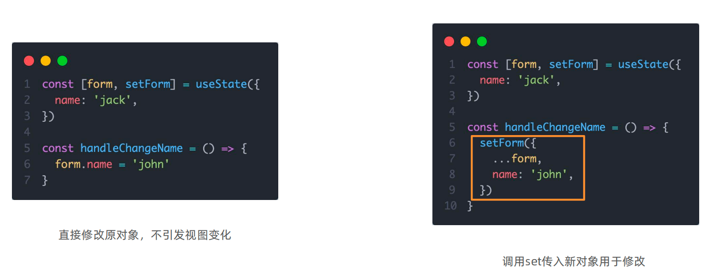

# 开发环境创建

create-react-app 是一个快速创建 React 开发环境的工具，底层由 Webpack 构件，封装了配置细节，开箱即用
执行命令：

```bash
npx create-react-app react-basic
```

1. npx - Node.js 工具命令，查找并执行后续的包命令
2. create-react-app - 核心包（固定写法），用于创建 React 项目
3. react-basic React 项目的名称（可以自定义）
   :::warning
   创建 React 项目的更多方式
   [https://zh-hans.react.dev/learn/start-a-new-react-project](https://zh-hans.react.dev/learn/start-a-new-react-project)
   :::

# JSX 基础

## 什么是 JSX

> 概念：JSX 是 JavaScript 和 XMl(HTML)的缩写，表示在 JS 代码中编写 HTML 模版结构，它是 React 中构建 UI 的方式

```jsx
const message = "this is message";

function App() {
  return (
    <div>
      <h1>this is title</h1>
      {message}
    </div>
  );
}
```

优势：

1. HTML 的声明式模版写法
2. JavaScript 的可编程能力

## JSX 的本质

> JSX 并不是标准的 JS 语法，它是 JS 的语法扩展，浏览器本身不能识别，需要通过解析工具做解析之后才能在浏览器中使用


## JSX 高频场景-JS 表达式

> 在 JSX 中可以通过 `大括号语法{}` 识别 JavaScript 中的表达式，比如常见的变量、函数调用、方法调用等等

1. 使用引号传递字符串
2. 使用 JS 变量
3. 函数调用和方法调用
4. 使用 JavaScript 对象
   :::warning
   注意：if 语句、switch 语句、变量声明不属于表达式，不能出现在{}中
   :::

```jsx
const message = "this is message";

function getAge() {
  return 18;
}

function App() {
  return (
    <div>
      <h1>this is title</h1>
      {/* 字符串识别 */}
      {"this is str"}
      {/* 变量识别 */}
      {message}
      {/* 变量识别 */}
      {message}
      {/* 函数调用 渲染为函数的返回值 */}
      {getAge()}
    </div>
  );
}
```

## JSX 高频场景-列表渲染


> 在 JSX 中可以使用原生 js 种的`map方法` 实现列表渲染

```jsx
const list = [
  { id: 1001, name: "Vue" },
  { id: 1002, name: "React" },
  { id: 1003, name: "Angular" },
];

function App() {
  return (
    <ul>
      {list.map((item) => (
        <li key={item.id}>{item}</li>
      ))}
    </ul>
  );
}
```

## JSX 高频场景-条件渲染


> 在 React 中，可以通过逻辑与运算符&&、三元表达式(?:) 实现基础的条件渲染

```jsx
const flag = true;
const loading = false;

function App() {
  return (
    <>
      {flag && <span>this is span</span>}
      {loading ? <span>loading...</span> : <span>this is span</span>}
    </>
  );
}
```

## JSX 高频场景-复杂条件渲染


> 需求：列表中需要根据文章的状态适配
> 解决方案：自定义函数 + 判断语句

```jsx
const type = 1  // 0|1|3

function getArticleJSX(){
  if(type === 0){
    return <div>无图模式模版</div>
  }else if(type === 1){
    return <div>单图模式模版</div>
  }else(type === 3){
    return <div>三图模式模版</div>
  }
}

function App(){
  return (
    <>
      { getArticleJSX() }
    </>
  )
}
```

# React 的事件绑定

## 基础实现

> React 中的事件绑定，通过语法 `on + 事件名称 = { 事件处理程序 }`，整体上遵循驼峰命名法

```jsx
function App() {
  const clickHandler = () => {
    console.log("button按钮点击了");
  };
  return <button onClick={clickHandler}>click me</button>;
}
```

## 使用事件参数

> 在事件回调函数中设置形参 e 即可

```jsx
function App() {
  const clickHandler = (e) => {
    console.log("button按钮点击了", e);
  };
  return <button onClick={clickHandler}>click me</button>;
}
```

## 传递自定义参数

> 语法：事件绑定的位置改造成箭头函数的写法，在执行 clickHandler 实际处理业务函数的时候传递实参

```jsx
function App() {
  const clickHandler = (name) => {
    console.log("button按钮点击了", name);
  };
  return <button onClick={() => clickHandler("jack")}>click me</button>;
}
```

:::warning
注意：不能直接写函数调用，这里事件绑定需要一个函数引用
:::

## 同时传递事件对象和自定义参数

> 语法：在事件绑定的位置传递事件实参 e 和自定义参数，clickHandler 中声明形参，注意顺序对应

```jsx
function App() {
  const clickHandler = (name, e) => {
    console.log("button按钮点击了", name, e);
  };
  return <button onClick={(e) => clickHandler("jack", e)}>click me</button>;
}
```

# React 组件基础使用

## 组件是什么

概念：一个组件就是一个用户界面的一部分，它可以有自己的逻辑和外观，组件之间可以互相嵌套，也可以服用多次


## 组件基础使用

> 在 React 中，一个组件就是**首字母大写的函数**，内部存放了组件的逻辑和视图 UI, 渲染组件只需要把组件当成标签书写即可

```jsx
// 1. 定义组件
function Button() {
  return <button>click me</button>;
}

// 2. 使用组件
function App() {
  return (
    <div>
      {/* 自闭和 */}
      <Button />
      {/* 成对标签 */}
      <Button></Button>
    </div>
  );
}
```

# 组件状态管理-useState

## 基础使用

> useState 是一个 React Hook（函数），它允许我们向组件添加一个`状态变量`, 从而控制影响组件的渲染结果
> 和普通 JS 变量不同的是，状态变量一旦发生变化组件的视图 UI 也会跟着变化（数据驱动视图）


```jsx
function App() {
  const [count, setCount] = React.useState(0);
  return (
    <div>
      <button onClick={() => setCount(count + 1)}>{count}</button>
    </div>
  );
}
```

## 状态的修改规则

> 在 React 中状态被认为是只读的，我们应该始终`替换它而不是修改它`, 直接修改状态不能引发视图更新


## 修改对象状态

> 对于对象类型的状态变量，应该始终给 set 方法一个`全新的对象` 来进行修改



# 组件的基础样式处理

> React 组件基础的样式控制有俩种方式，行内样式和 class 类名控制

```jsx
<div style={{ color: "red" }}>this is div</div>
```

```css
.foo {
  color: red;
}
```

```jsx
import "./index.css";

function App() {
  return (
    <div>
      <span className="foo">this is span</span>
    </div>
  );
}
```

# B 站评论案例


1. 渲染评论列表
2. 删除评论实现
3. 渲染导航 Tab 和高亮实现
4. 评论列表排序功能实现

## 完成版本

```jsx
import { useState } from "react";
import "./App.scss";
import avatar from "./images/bozai.png";
import orderBy from "lodash/orderBy";
/**
 * 评论列表的渲染和操作
 * 1. 根据状态渲染评论列表
 * 2. 删除评论
 */
// 评论列表数据
const defaultList = [
  {
    // 评论id
    rpid: 3,
    // 用户信息
    user: {
      uid: "13258165",
      avatar: "",
      uname: "周杰伦",
    },
    // 评论内容
    content: "哎哟，不错哦",
    // 评论时间
    ctime: "10-18 08:15",
    like: 88,
  },
  {
    rpid: 2,
    user: {
      uid: "36080105",
      avatar: "",
      uname: "许嵩",
    },
    content: "我寻你千百度 日出到迟暮",
    ctime: "11-13 11:29",
    like: 88,
  },
  {
    rpid: 1,
    user: {
      uid: "30009257",
      avatar,
      uname: "黑马前端",
    },
    content: "学前端就来黑马",
    ctime: "10-19 09:00",
    like: 66,
  },
];
// 当前登录用户信息
const user = {
  // 用户id
  uid: "30009257",
  // 用户头像
  avatar,
  // 用户昵称
  uname: "黑马前端",
};
/**
 * 导航 Tab 的渲染和操作
 * 1. 渲染导航 Tab 和高亮
 * 2. 评论列表排序
 *  最热 => 喜欢数量降序
 *  最新 => 创建时间降序
 */
// 导航 Tab 数组
const tabs = [
  { type: "hot", text: "最热" },
  { type: "time", text: "最新" },
];

const App = () => {
  // 导航 Tab 高亮的状态
  const [activeTab, setActiveTab] = useState("hot");
  const [list, setList] = useState(defaultList);
  // 删除评论
  const onDelete = (rpid) => {
    // 如果要删除数组中的元素，需要调用 filter 方法，并且一定要调用 setList 才能更新状态
    setList(list.filter((item) => item.rpid !== rpid));
  };
  // tab 高亮切换
  const onToggle = (type) => {
    setActiveTab(type);
    let newList;
    if (type === "time") {
      // 按照时间降序排序
      // orderBy(对谁进行排序, 按照谁来排, 顺序)
      newList = orderBy(list, "ctime", "desc");
    } else {
      // 按照喜欢数量降序排序
      newList = orderBy(list, "like", "desc");
    }
    setList(newList);
  };

  return (
    <div className="app">
      {/* 导航 Tab */}
      <div className="reply-navigation">
        <ul className="nav-bar">
          <li className="nav-title">
            <span className="nav-title-text">评论</span>
            {/* 评论数量 */}
            <span className="total-reply">{list.length}</span>
          </li>
          <li className="nav-sort">
            {/* 高亮类名： active */}
            {tabs.map((item) => {
              return (
                <div
                  key={item.type}
                  className={
                    item.type === activeTab ? "nav-item active" : "nav-item"
                  }
                  onClick={() => onToggle(item.type)}
                >
                  {item.text}
                </div>
              );
            })}
          </li>
        </ul>
      </div>

      <div className="reply-wrap">
        {/* 发表评论 */}
        <div className="box-normal">
          {/* 当前用户头像 */}
          <div className="reply-box-avatar">
            <div className="bili-avatar">
              
            </div>
          </div>
          <div className="reply-box-wrap">
            {/* 评论框 */}
            <textarea
              className="reply-box-textarea"
              placeholder="发一条友善的评论"
            />
            {/* 发布按钮 */}
            <div className="reply-box-send">
              <div className="send-text">发布</div>
            </div>
          </div>
        </div>
        {/* 评论列表 */}
        <div className="reply-list">
          {/* 评论项 */}
          {list.map((item) => {
            return (
              <div key={item.rpid} className="reply-item">
                {/* 头像 */}
                <div className="root-reply-avatar">
                  <div className="bili-avatar">
                    
                  </div>
                </div>

                <div className="content-wrap">
                  {/* 用户名 */}
                  <div className="user-info">
                    <div className="user-name">{item.user.uname}</div>
                  </div>
                  {/* 评论内容 */}
                  <div className="root-reply">
                    <span className="reply-content">{item.content}</span>
                    <div className="reply-info">
                      {/* 评论时间 */}
                      <span className="reply-time">{item.ctime}</span>
                      {/* 评论数量 */}
                      <span className="reply-time">点赞数:{item.like}</span>
                      {user.uid === item.user.uid && (
                        <span
                          className="delete-btn"
                          onClick={() => onDelete(item.rpid)}
                        >
                          删除
                        </span>
                      )}
                    </div>
                  </div>
                </div>
              </div>
            );
          })}
        </div>
      </div>
    </div>
  );
};
export default App;
```
