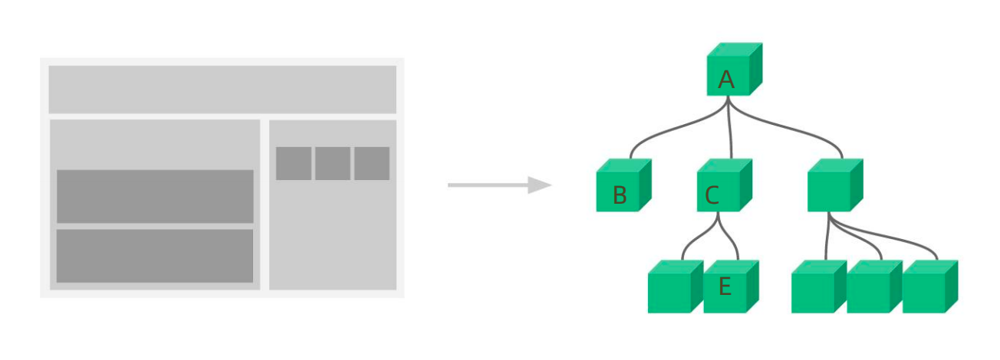
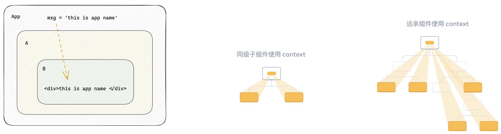
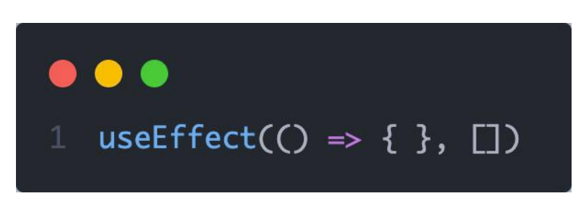

# React表单控制
## 受控绑定
> 概念：使用React组件的状态（useState）控制表单的状态


```jsx
function App(){
  const [value, setValue] = useState('')
  return (
    <input 
      type="text" 
      value={value} 
      onChange={e => setValue(e.target.value)}
    />
  )
}
```
## 非受控绑定
> 概念：通过获取DOM的方式获取表单的输入数据

```jsx
function App(){
  const inputRef = useRef(null)

  const onChange = ()=>{
    console.log(inputRef.current.value)
  }
  
  return (
    <input 
      type="text" 
      ref={inputRef}
      onChange={onChange}
    />
  )
}
```
# 案例-B站评论案例


1. 手机输入框评论内容，并发布评论
2. id处理和时间处理（uuid 和 day.js）
# React组件通信
> 概念：组件通信就是`组件之间的数据传递`, 根据组件嵌套关系的不同，有不同的通信手段和方法



1. A-B 父子通信
2. B-C 兄弟通信
3. A-E 跨层通信
# 父子通信-父传子

## 基础实现
**实现步骤 **
1. 父组件传递数据 - 在子组件标签上绑定属性 
2. 子组件接收数据 - 子组件通过props参数接收数据
```jsx
function Son(props){
  return <div>{ props.name }</div>
}


function App(){
  const name = 'this is app name'
  return (
    <div>
       <Son name={name}/>
    </div>
  )
}
```
## props说明
**props可以传递任意的合法数据**，比如数字、字符串、布尔值、数组、对象、函数、JSX

**props是只读对象**
子组件只能读取props中的数据，不能直接进行修改, 父组件的数据只能由父组件修改 

## 特殊的prop-chilren
> 场景：当我们把内容嵌套在组件的标签内部时，组件会自动在名为children的prop属性中接收该内容


# 父子通信-子传父

> 核心思路：在子组件中调用父组件中的函数并传递参数

```tsx
function Son({ onGetMsg }){
  const sonMsg = 'this is son msg'
  return (
    <div>
      {/* 在子组件中执行父组件传递过来的函数 */}
      <button onClick={()=>onGetMsg(sonMsg)}>send</button>
    </div>
  )
}


function App(){
  const getMsg = (msg)=>console.log(msg)
  
  return (
    <div>
      {/* 传递父组件中的函数到子组件 */}
       <Son onGetMsg={ getMsg }/>
    </div>
  )
}
```
# 兄弟组件通信

> 实现思路: 借助 `状态提升` 机制，通过共同的父组件进行兄弟之间的数据传递
> 1. A组件先通过子传父的方式把数据传递给父组件App
> 2. App拿到数据之后通过父传子的方式再传递给B组件

```jsx
// 1. 通过子传父 A -> App
// 2. 通过父传子 App -> B
import { useState } from "react"

function A ({ onGetAName }) {
  // Son组件中的数据
  const name = 'this is A name'
  return (
    <div>
      this is A compnent,
      <button onClick={() => onGetAName(name)}>send</button>
    </div>
  )
}

function B ({ name }) {
  return (
    <div>
      this is B compnent,
      {name}
    </div>
  )
}

function App () {
  const [name, setName] = useState('')
  const getAName = (name) => {
    setName(name)
  }
  return (
    <div>
      this is App
      <A onGetAName={getAName} />
      <B name={name} />
    </div>
  )
}
export default App
```
# 跨层组件通信

**实现步骤：**

1. 使用 `createContext`方法创建一个上下文对象Ctx 
2. 在顶层组件（App）中通过 `Ctx.Provider` 组件提供数据 
3. 在底层组件（B）中通过 `useContext` 钩子函数获取消费数据
```jsx
// App -> A -> B
import { createContext, useContext } from "react"
// 1. createContext方法创建一个上下文对象
const MsgContext = createContext()

function A () {
  return (
    <div>
      this is A component
      <B />
    </div>
  )
}

function B () {
  // 3. 在底层组件 通过useContext钩子函数使用数据
  const msg = useContext(MsgContext)
  return (
    <div>
      this is B compnent,{msg}
    </div>
  )
}

function App () {
  const msg = 'this is app msg'
  return (
    <div>
      {/* 2. 在顶层组件 通过Provider组件提供数据 */}
      <MsgContext.Provider value={msg}>
        this is App
        <A />
      </MsgContext.Provider>
    </div>
  )
}
export default App
```

# React副作用管理-useEffect
## 概念理解 
useEffect是一个React Hook函数，用于在React组件中创建不是由事件引起而是由渲染本身引起的操作（副作用）, 比 如发送AJAX请求，更改DOM等等 

:::warning
说明：上面的组件中没有发生任何的用户事件，组件渲染完毕之后就需要和服务器要数据，整个过程属于“只由渲染引起的操作”
:::

## 基础使用
> 需求：在组件渲染完毕之后，立刻从服务端获取平道列表数据并显示到页面中


说明： 

1. 参数1是一个函数，可以把它叫做副作用函数，在函数内部可以放置要执行的操作 
2. 参数2是一个数组（可选参），在数组里放置依赖项，不同依赖项会影响第一个参数函数的执行，当是一个空数组的时候，副作用函数只会在组件渲染完毕之后执行一次   
:::warning
接口地址：http://geek.itheima.net/v1_0/channels
:::
## useEffect依赖说明 
useEffect副作用函数的执行时机存在多种情况，根据传入依赖项的不同，会有不同的执行表现

| **依赖项** | **副作用功函数的执行时机** |
| --- | --- |
| 没有依赖项 | 组件初始渲染 + 组件更新时执行 |
| 空数组依赖 | 只在初始渲染时执行一次 |
| 添加特定依赖项 | 组件初始渲染 + 依赖项变化时执行 |

## 清除副作用
> 概念：在useEffect中编写的由渲染本身引起的对接组件外部的操作，社区也经常把它叫做副作用操作，比如在useEffect中开启了一个定时器，我们想在组件卸载时把这个定时器再清理掉，这个过程就是清理副作用


:::warning
说明：清除副作用的函数最常见的执行时机是在组件卸载时自动执行
:::

```jsx
import { useEffect, useState } from "react"

function Son () {
  // 1. 渲染时开启一个定时器
  useEffect(() => {
    const timer = setInterval(() => {
      console.log('定时器执行中...')
    }, 1000)
    return () => {
      // 清除副作用(组件卸载时)
      clearInterval(timer)
    }
  }, [])
  return <div>this is son</div>
}

function App () {
  // 通过条件渲染模拟组件卸载
  const [show, setShow] = useState(true)
  return (
    <div>
      {show && <Son />}
      <button onClick={() => setShow(false)}>卸载Son组件</button>
    </div>
  )
}
export default App
```
# 自定义Hook实现
> 概念：自定义Hook是以 `use打头的函数`，通过自定义Hook函数可以用来`实现逻辑的封装和复用`


```jsx
// 封装自定义Hook
// 问题: 布尔切换的逻辑 当前组件耦合在一起的 不方便复用
// 解决思路: 自定义hook
import { useState } from "react"

// 封装自定义hook通用思路
// 1. 声明一个以use打头的函数
// 2. 在函数体内封装可复用的逻辑（只要是可复用的逻辑）
// 3. 把组件中用到的状态或者回调return出去（以对象或者数组）
function useToggle () {
  // 可复用的逻辑代码
  const [value, setValue] = useState(true)
  const toggle = () => setValue(!value)
  // 哪些状态和回调函数需要在其他组件中使用 return
  return {
    value,
    toggle
  }
}

function App () {
  // 4. 在哪个组件中要用到这个逻辑，就执行这个函数，解构出来状态和回调进行使用
  const { value, toggle } = useToggle()
  return (
    <div>
      {value && <div>this is div</div>}
      <button onClick={toggle}>toggle</button>
    </div>
  )
}
export default App
```
# React Hooks使用规则

1. 只能在组件中或者其他自定义Hook函数中调用
2. 只能在组件的顶层调用，不能嵌套在if、for、其它的函数中


# 案例-优化B站评论案例

1. 使用请求接口的方式获取评论列表并渲染 
2. 使用自定义Hook函数封装数据请求的逻辑 
3. 把评论中的每一项抽象成一个独立的组件实现渲染

```jsx

import { useEffect, useRef, useState } from 'react'
import './App.scss'
import avatar from './images/bozai.png'
import _ from 'lodash'
import classNames from 'classnames'
import { v4 as uuidV4 } from 'uuid'
import dayjs from 'dayjs'
import axios from 'axios'

// 当前登录用户信息
const user = {
  // 用户id
  uid: '30009257',
  // 用户头像
  avatar,
  // 用户昵称
  uname: '黑马前端',
}
// 导航 Tab 数组
const tabs = [
  { type: 'hot', text: '最热' },
  { type: 'time', text: '最新' },
]

// 封装请求数据的Hook
function useGetList() {
  // 获取接口数据渲染
  const [commentList, setCommentList] = useState([])

  useEffect(() => {
    // 请求数据
    async function getList() {
      // axios请求数据
      const res = await axios.get(' http://localhost:3004/list')
      setCommentList(res.data)
    }
    getList()
  }, [])

  return {
    commentList,
    setCommentList
  }
}

// 封装Item组件
function Item({ item, onDel }) {
  return (
    <div className="reply-item">
      {/* 头像 */}
      <div className="root-reply-avatar">
        <div className="bili-avatar">
          
        </div>
      </div>

      <div className="content-wrap">
        {/* 用户名 */}
        <div className="user-info">
          <div className="user-name">{item.user.uname}</div>
        </div>
        {/* 评论内容 */}
        <div className="root-reply">
          <span className="reply-content">{item.content}</span>
          <div className="reply-info">
            {/* 评论时间 */}
            <span className="reply-time">{item.ctime}</span>
            {/* 评论数量 */}
            <span className="reply-time">点赞数:{item.like}</span>
            {/* 条件：user.id === item.user.id */}
            {user.uid === item.user.uid &&
              <span className="delete-btn" onClick={() => onDel(item.rpid)}>
                删除
              </span>}
          </div>
        </div>
      </div>
    </div>
  )
}

const App = () => {
  // 渲染评论列表
  // 1. 使用useState维护list
  // const [commentList, setCommentList] = useState(_.orderBy(list, 'like', 'desc'))
  const { commentList, setCommentList } = useGetList()

  // 删除功能
  const handleDel = (id) => {
    console.log(id)
    // 对commentList做过滤处理
    setCommentList(commentList.filter(item => item.rpid !== id))
  }

  // tab切换功能
  // 1. 点击谁就把谁的type记录下来
  // 2. 通过记录的type和每一项遍历时的type做匹配 控制激活类名的显示
  const [type, setType] = useState('hot')
  const handleTabChange = (type) => {
    console.log(type)
    setType(type)
    // 基于列表的排序
    if (type === 'hot') {
      // 根据点赞数量排序 
      // lodash
      setCommentList(_.orderBy(commentList, 'like', 'desc'))
    } else {
      // 根据创建时间排序
      setCommentList(_.orderBy(commentList, 'ctime', 'desc'))
    }
  }

  // 发表评论
  const [content, setContent] = useState('')
  const inputRef = useRef(null)
  const handlPublish = () => {
    setCommentList([
      ...commentList,
      {
        rpid: uuidV4(), // 随机id
        user: {
          uid: '30009257',
          avatar,
          uname: '黑马前端',
        },
        content: content,
        ctime: dayjs(new Date()).format('MM-DD hh:mm'), // 格式化 月-日 时:分
        like: 66,
      }
    ])
    // 1. 清空输入框的内容
    setContent('')
    // 2. 重新聚焦  dom(useRef) - focus
    inputRef.current.focus()
  }

  return (
    <div className="app">
      {/* 导航 Tab */}
      <div className="reply-navigation">
        <ul className="nav-bar">
          <li className="nav-title">
            <span className="nav-title-text">评论</span>
            {/* 评论数量 */}
            <span className="total-reply">{10}</span>
          </li>
          <li className="nav-sort">
            {/* 高亮类名： active */}
            {tabs.map(item =>
              <span
                key={item.type}
                onClick={() => handleTabChange(item.type)}
                className={classNames('nav-item', { active: type === item.type })}>
                {item.text}
              </span>)}
          </li>
        </ul>
      </div>

      <div className="reply-wrap">
        {/* 发表评论 */}
        <div className="box-normal">
          {/* 当前用户头像 */}
          <div className="reply-box-avatar">
            <div className="bili-avatar">
              
            </div>
          </div>
          <div className="reply-box-wrap">
            {/* 评论框 */}
            <textarea
              className="reply-box-textarea"
              placeholder="发一条友善的评论"
              ref={inputRef}
              value={content}
              onChange={(e) => setContent(e.target.value)}
            />
            {/* 发布按钮 */}
            <div className="reply-box-send">
              <div className="send-text" onClick={handlPublish}>发布</div>
            </div>
          </div>
        </div>
        {/* 评论列表 */}
        <div className="reply-list">
          {/* 评论项 */}
          {commentList.map(item => <Item key={item.id} item={item} onDel={handleDel} />)}
        </div>
      </div>
    </div>
  )
}

export default App

```

